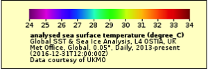
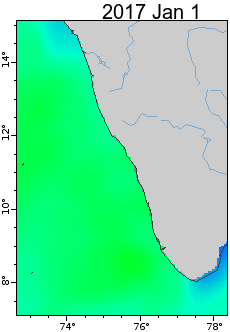

```{r setup, include=FALSE}
knitr::opts_chunk$set(echo = TRUE, eval=FALSE)
```

These SST images are from the Global SST & Sea Ice Analysis, L4 OSTIA, UK Met Office, Global, 0.05°, Daily, 
2013-present product [here](https://coastwatch.pfeg.noaa.gov/erddap/griddap/jplUKMO_OSTIAv20.html).  SST is shown every 2 days.

Coastal upwelling can be seen when cold water is near the coast while warmer water is off-shore. The oil sardine catch experienced a peak in the 2012 season (fall 2012 to spring 2013) and then declined.  In the 2016 season (fall 2016 to spring 2017), the catch collapsed.  It recovered somewhat in the 2017 season.

You will probably need to reload to get the gifs synced up in time. Or scroll down to use the video.

<div style="text-align:center" markdown="1">

| Legend        |           |
| ------------- |:-------------:|
|       |  |
|  |  |

</div>

<video width="400" controls>
  <source src="Kochin_SST_2014-17.mp4" type="video/mp4">
  Your browser does not support HTML5 video.
</video>


