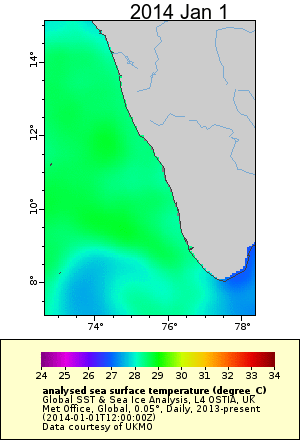

```{r setup, include=FALSE}
knitr::opts_chunk$set(echo = TRUE, eval=FALSE)
```

These SST images are from the Global SST & Sea Ice Analysis, L4 OSTIA, UK Met Office, Global, 0.05°, Daily, 
2013-present product [here](https://coastwatch.pfeg.noaa.gov/erddap/griddap/jplUKMO_OSTIAv20.html).  SST is shown every 2 days.

Coastal upwelling can be seen when cold water is near the coast while warmer water is off-shore.

<div style="text-align:center" markdown="1">

 

</div>


